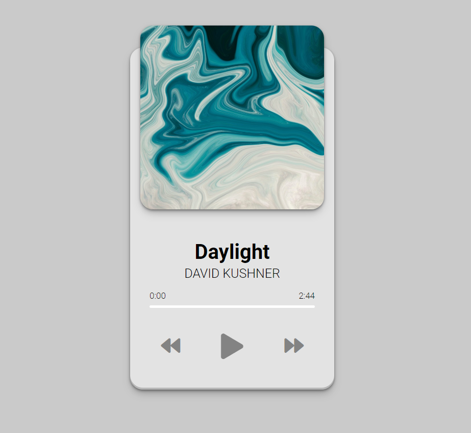

# Project Name

## Introduction

Welcome to project Music Player!

This repository contains code for a music player made in Js.

- **Live Link:** [Link to Live Demo](https://mbilal-x.github.io/js-20__music-player/)
- **Code Link:** [Link to Code Repository](https://mbilal-x.github.io/js-20__music-player/)
- **Screenshot** 

## Technologies Used

- HTML
- CSS
- Js

## Process

I basically tried to recreate this music player watching a tutorial. I Kept that same design and recreated it. I Used Js to create the music playing functionality to my requirements.
Also I plan on adding the feature of fetching music from my local storage here too. But for now the music objects are hard coded into the code.

## Motivation

The motivation behind making this project was to get used to using Js to code actual use cases and learing to use local storage.
